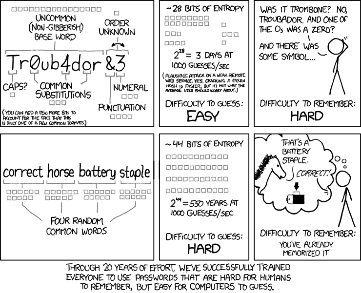

Everyone likes staying safe online, it's drilled into your head over and over and over. But how do you actually do that? One very good way is to use strong passwords. But what is a strong password? The answer may surprise you...

The attached comic actually demonstrates the problem with how a lot of people choose their passwords: it is both hard for you to remember, and it's also easy for a computer to guess!

_So what to do?_

Create long passwords with phrases that you can remember easily, but would be exceptionally hard for someone to guess. If you have to satisfy requirements for a site such as using punctuation, try to do it in a way that's intuitive:

```
frycook@thekrustykrab4life
For punctuation and numbers, or
idon'tevenknowwhyineedthislongofapassword
if only one symbol is needed, or get crazy:
The1JollyRogerwilldock@noon!
```

The key to remember is: the longer, the better; throwing in a few punctuation marks or numbers can be helpful, but the most important thing is the length!

Stay posted for more password tips - Oh and obviously, don't use any of the sample passwords. Make up your own. From: https://xkcd.com/936/


