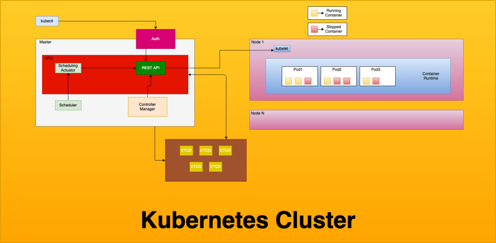
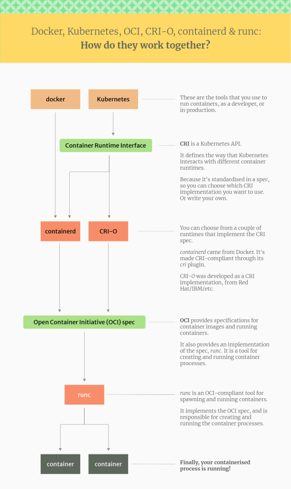

## Kubernetes Overview

Kubernetes, or as some call it, k8s. It's the talk of the town. Well, at least if you work in DevOps like I do. So what is Kubernetes for those who have been living under a rock, or maybe those who are tech-adjacent but not super familiar with the tools? From the Kubernetes website itself:

> "Kubernetes is a portable, extensible, open-source platform for managing containerized workloads and services, that facilitates both declarative configuration and automation"
> 
> What is Kubernetes? ([link](https://kubernetes.io/docs/concepts/overview/what-is-kubernetes/))

## Why Would You Use Kubernetes?

Kubernetes was originally developed by Google as a container orchestration tool, a way to not only manage all of your containers, but perform other tasks to make running an environment based on containers easier; it functions as the 'brain' behind the scenes so to speak, performing quite a few management tasks that in the past were done manually, or with a plethora of other tools. Some of this functionality includes:

- Service discovery: automatically detect services running on a network
- Load Balancing between multiple containers running the same service
- Automated state control, i.e. the ability to change the desired state of your containers, and k8s will automatically detect the current state and perform tasks to bring your container to the desired state
- Self-Healing. K8s will automatically detect issues with deployed containers and restart those in a failed state
- DNS management: k8s runs [kube-dns](https://github.com/kubernetes/dns) by default, but [core-dns](https://github.com/coredns/coredns) is also available. Whichever you use, the important part is that when k8s deploys a container, or scales from 2 containers to 20, you don't have to fuss with assigning IPs or telling your other containers how to reach these new containers, this is all handled automatically
- Secrets management: k8s comes with built in secrets storage that allows you to utilize sensitive information, such as oAuth tokens, keys, passwords, etc, without exposing those secrets to the rest of the cluster.
    - Secrets are stored in [etcd](https://github.com/etcd-io/etcd), and by default are stored in unencrypted Base64 format. With anything outside of a development/personal cluster, you will need to implement additional security measures, such as encryption of data at rest. This is beyond the scope of this article, however I do plan to do a follow up article on securing Kubernetes, so stay tuned :)
- Built in metrics gathering via the [Metrics API](https://github.com/kubernetes/metrics) (accessible via API call to the /metrics endpoint)
- Auto-scaling: k8s has built in scaling for both pods and cluster nodes:
    
    - Pod autoscaling is handled by the [HPA, or Horizontal Pod Autoscaler](https://github.com/kubernetes/autoscaler), and scales pods based on resource usage
    - Cluster autoscaling is handled by the [Cluster Autoscaler](https://github.com/kubernetes/autoscaler/tree/master/cluster-autoscaler), which scales the size of the cluster based on a variety of different metrics
    - This scaling can be based on quite a few different metrics, including by not limited to:
        - CPU
        - Memory
        - Pod QPS (queries per second)
        - Pod query latency
    
    - Additional scaling abilities can be enabled if you use the "[kube-state-metrics](https://github.com/kubernetes/kube-state-metrics)" add-on service. This add-on adds the ability to collect kubernetes state information, which is then converted into metrics; once in metric form, you can then easily log these events, and the autoscalers can act upon them to trigger scaling events. These additional metrics include but are not limited to:
        - \# of replicas scheduled vs available
        - \# of pods running vs stopped vs terminated
        - \# of pod restarts for a given pod

## Overview of Kubernetes Components and Basic Architecture

I'm not going to go too deep into each of the components, because I plan on making this a series, both so that I can keep the size of the articles down so you fine people keep reading them. I do however want to go over a high level overview so you can see how a basic cluster is laid out, which may help you to understand the functionality of a k8s cluster a little better.  
  
So on that note, lets have a look over what a basic Kubernetes architecture looks like, and then go over the basics of each of the components.

This is a pretty basic overview of a cluster, and doesn't include some of the things that you will see running on the cluster, such as any Ingress controllers or external load balancers, metric collectors, etc. That being said, as I start getting more detailed as we go through this article series, I will add details to the relevant pieces of the diagram. We will keep using this basic diagram, but "zoom in", if you will, to describe specific parts, but for now we can use this basic diagram to explain the core cluster pieces.

### Master ([docs](https://docs.openshift.com/enterprise/3.0/architecture/infrastructure_components/kubernetes_infrastructure.html#master))

The master nodes of a cluster contain the control plane resources, including the API server, Etcd, the Scheduler and Scheduling Actuator, the Controller Manager, and Authentication for cluster access. When running serverless Kubernetes, the control plane resources are typically what is managed by the service provider, such as EKS for Amazon (Elastic Kubernetes Service), AKS for Azure (Azure Kubernetes Service) or GKE for Google Cloud (Google Kubernetes Engine).

### Node ([docs](https://kubernetes.io/docs/concepts/architecture/nodes/))

Nodes in a k8s cluster contain the data plane resources, and are referred to as worker nodes. Every worker node contains kubelet, which is how the API interacts with the node, a container runtime (most commonly Docker), and your application workload pods. When running serverless k8s, the data plane resources are still managed by you.

### Kubectl ([docs](https://kubernetes.io/docs/reference/kubectl/overview/))

Kubectl is how you interact with your cluster. You use kubectl to depoy resources, inspect the cluster state, and view logs on the cluster and in your pods.

### REST API ([docs](https://kubernetes.io/docs/reference/using-api/))

The REST API is a control plane component, and handles all communication between components of the cluster, as well as any user interaction, including but not limited to deploying resources and querying logs. To over-simplify things, every single interaction with the cluster goes through the REST API, both external communication from the user or programs, and internal communication such as metric streaming, pod scaling, deployment, and termination etc. The k8s REST API has SDKs for many different languages which enables building custom tools for your cluster.

### Scheduler ([docs](https://kubernetes.io/docs/concepts/scheduling-eviction/kube-scheduler/))

The scheduler is a control plane component, by default kube-scheduler. You can utilize other schedulers including autoscalers, and even write your own scheduler if that's your jam, but keep in mind this an EXTREMELY vital piece of your cluster, and errors with the scheduler will cause you lots of problem. The scheduler is responsible for, as the name implies, scheduling pods. The scheduler takes the pod definition, and finds a node that can accommodate the pod based of the pods defined resource requirements.

### Controller Manager ([docs](https://kubernetes.io/docs/reference/command-line-tools-reference/kube-controller-manager/))

The controller manager is a control plane component, and runs as a daemon; it runs constantly in an infinite loop reading the cluster. The controller manager is responsible for ensuring the cluster state matches what you define, and does so by querying the REST API for cluster state, and seeks to move the cluster towards a desired state. This is a fancy way of saying it checks to make sure your cluster is running according to the way you've told it to through your configuration. There are several controllers inside of k8s, including but not limited to:

- replication controller
- endpoints controller
- namespace controller
- service account controller

### ETCD ([docs](https://etcd.io/docs/))

Etcd runs on the control plane, and is a distributed data store that k8s uses to store cluster information, including all of your data plane definitions (your yaml configs for all of your deployments, daemon sets, etc) as well as secrets management. Etcd is the default data store for kubernetes, however you are free to use pretty much any data store, providing that it is distributed. Due to the nature of what is stored here (basically every piece of information about the cluster state, among other things) you want to be sure to have a robust back-up plan for everything contained inside it.

### Cloud-Controller-Manager ([docs](https://kubernetes.io/docs/concepts/architecture/cloud-controller/))

The cloud-controller-manager component is an optional control plane component that is used to interface with a cloud providers API, and allows you to separate components that need to interact with the cloud provider and those that do not. The Node Controller, Route Controller, and Service Controller all can be linked to the cloud-controller-manager and can perform functions such as external DNS management (route controller), node scaling (node controller) and managing external load balancers. (service controller)

### Kube-Proxy ([docs](https://kubernetes.io/docs/reference/command-line-tools-reference/kube-proxy/))

Kube-proxy is a data plane component which runs on every node, and handles network communication to your nodes. If available, kube-proxy will attempt to use the underlying OS's packet filtering, however it will fallback to just forwarding traffic itself should this not be available.

### Container Runtime ([docs](https://kubernetes.io/docs/setup/production-environment/container-runtimes))

The container runtime is a data plane component, and is what actually runs your containers. While [docker](https://kubernetes.io/docs/setup/production-environment/container-runtimes/#docker) is by far the most common runtime, k8s actually supports a few different runtimes, including:

- **CRI-O**
    - CRI-O is an alternate container runtime that implements the kubernetes CRI, or Container Runtime Interface. CRI-O is a lightweight alternative to using docker. The interesting thing about using CRI-O is that while docker and containerd utilize runc, CRI-O allows you to use ANY OCI (Open Container Initiative) compliant runtime. While it officially supports runc and Kata-containers, in theory you can plug any runtime that is OCI compliant into it. These runtimes include but are not limited to:
        
        - Native runtimes
            - runC
            - Railcar
            - Crun
            - rkt
        
        - Sandboxes runtimes
            - gviso
            - nabla-containers
            - runV
            - clearcontainers
            - kata-containers
    - These runtimes are the low level process that actually interface with the system, leveraging either cgroups or systemd to run the container on the operating system. I am already getting further into this than intended, but if you would like to read up further on low-level runtimes and the OCI initiative, you can do so [here.](https://www.capitalone.com/tech/cloud/container-runtime/)

- **Containerd ([docs](https://kubernetes.io/docs/setup/production-environment/container-runtimes/#containerd))**
    - containerd is used by docker internally, and is the piece that actually handles pulling and managing images, and passing the syscalls to [runc](https://github.com/opencontainers/runc) (a very low-level container runtime) to start/stop and otherwise interact with containers. The containerd runtime handles the meat and potatoes of container management, including fetching and managing images (push/pull) as well as running containers from those images. Docker itself uses containerd internally
- **Docker ([docs](https://docs.docker.com/))**
    - Docker is the most popular container runtime as of this writing, most reading this are probably at least minimally familiar with it, or at minimum have heard of it. Docker is meant to manage the entire container lifecycle and provides features such as public and private registries and other tooling to make lifecycle management of your containers and images easier. That being said, we are talking specifically about docker the container runtime; there is also Docker the company, which developed the runtime, however nowadays the company and the runtime environment are decoupled. This can lead to some confusion, so I have linked an article [here](https://www.tutorialworks.com/difference-docker-containerd-runc-crio-oci/) which attempts (and does a good job of, IMO) explaining some of the nuances.  
          
        That being said, being able to use both containerd and docker as a container runtime can be confusing if you are used to think about about Docker, the suite of tools that enables you to utilize registries among other things, and docker the container runtime, which is specifically used to manage containers and images.  
          
        

There are more runtimes, but these are the major ones that you might reasonably see in the wild, and while there are certainly reasons to utilize some of the other ones, that is going to have to be for another article. All of this might be a little confusing, so I have found the following diagram that attempts to explain how each of these components interacts, and shows from a high to low level how a container gets started:  
  

That's all that I have for you today, but I do plan on diving pretty deep into kubernetes over the coming weeks, so if you have any requests for what I should make the focus of the next article, please feel free to drop a comment, or hit the contact page to email me directly. I want to write content that will help you be successful with the kubernetes ecosystem, so let me know what you want to read about!  
  
~ _Happy Hacking ~_
