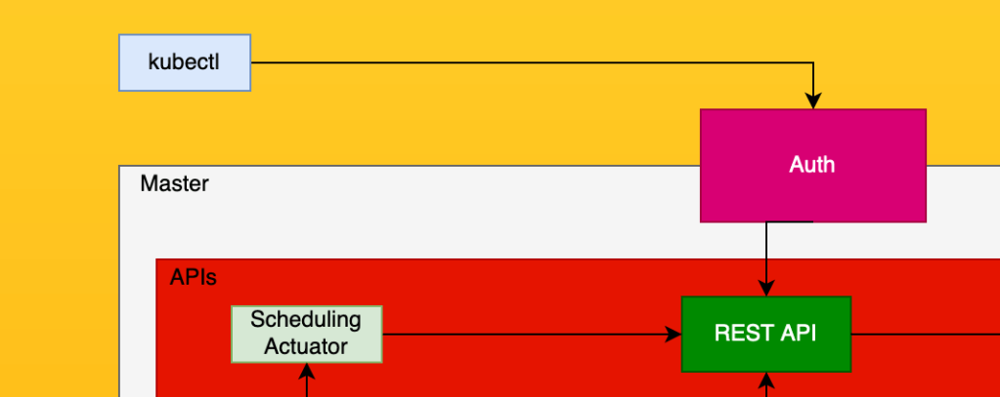
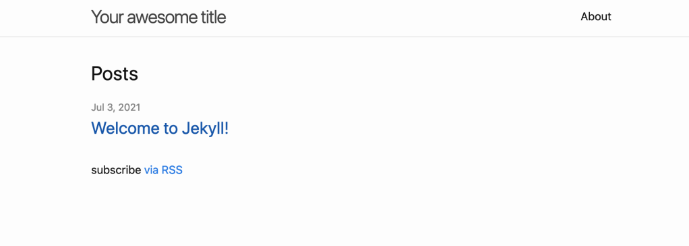

[In my last article](https://jhax777917040.wordpress.com/2021/07/02/lets-talk-kubernetes/), we over over the components of the Kubernetes cluster as well as the basic architecture. One of those components is kubectl, a command line (cli) tool that allows you to deploy resources, check the status of the cluster and pods, and perform administrative actions. You can get a basic overview of kubectl from the kubernetes documentation [here](https://kubernetes.io/docs/reference/kubectl/overview/).  
  
I'm going to go over some super basic usage of kubectl in this article, and then do a small deployment of a jekyll static blog to get your feet wet. There is a lot of information to go over with kubectl especially in regards to the authentication aspect, so to avoid one article getting too bloated I'm going to split it up into at least 2 parts, possibly more depending on how long each section gets. With that said, lets get started on part 1. 
  
In order to interact with the cluster, kubectl issues commands to the REST API, which then utilizes the other components in the k8s infrastructure to enact the command you issued. So lets go over how that actually happens. The first thing that needs to happen before you can connect to the cluster is authorization and authentication, so first things first, we will talk about how to configure kubectl so that it can talk to your cluster.

<figure>



<figcaption>

We are first going to go over kubectl installation, and then look at the first step kubectl takes, Authentication with the cluster

</figcaption>

</figure>

## Kubectl Setup

Kubectl can be installed on Linux, OSX, or Windows, and in that aspect is very versatile from an administrators standpoint. You can find the setup documentation for each OS at the following links:

- Linux
    - [Curl](https://kubernetes.io/docs/tasks/tools/install-kubectl-linux/#install-kubectl-binary-with-curl-on-linux)
    - [Debian package manager (Ubuntu)](https://kubernetes.io/docs/tasks/tools/install-kubectl-linux/#install-using-native-package-management)
    - [RHEL package manager (Centos)](https://phoenixnap.com/kb/how-to-install-kubernetes-on-centos)
    - [Snap](https://kubernetes.io/docs/tasks/tools/install-kubectl-linux/#install-using-other-package-management)
- OSX
    - [Curl](https://kubernetes.io/docs/tasks/tools/install-kubectl-macos/#install-kubectl-binary-with-curl-on-macos)
    - [Homebrew](https://kubernetes.io/docs/tasks/tools/install-kubectl-macos/#install-with-homebrew-on-macos)
    - [MacPorts](https://kubernetes.io/docs/tasks/tools/install-kubectl-macos/#install-with-macports-on-macos)
- Windows
    - [Curl](https://kubernetes.io/docs/tasks/tools/install-kubectl-windows/#install-kubectl-binary-with-curl-on-windows)
    - [Choco or Scoop](https://kubernetes.io/docs/tasks/tools/install-kubectl-windows/#install-on-windows-using-chocolatey-or-scoop)

Once you have installed kubectl you can make sure that it's functional by issuing the following command: `kubectl version --client`, and you should see version information in the output; if you receive an error, there is a problem with the installation, if it's working properly you should see output similar to the following:

```bash
$ kubectl version --client
Client Version: version.Info{Major:"1", Minor:"16", GitVersion:"v1.16.2", GitCommit:"c97fe5036ef3df2967d086711e6c0c405941e14b", GitTreeState:"clean", BuildDate:"2019-10-15T19:18:23Z", GoVersion:"go1.12.10", Compiler:"gc", Platform:"darwin/amd64"}
```

## Kubectl Configuration

The kubectl config file, by default, is going to be located in your home directory `~/.kube/config` and to quickly view your configuration you can issue the command `$kubectl config view`. the output of the command will show the contents of your config file, which include the cluster configuration, the context, and the user information including your certificate, which is how you actually authenticate with the cluster. The output of the config view command will redact the actual certificate information for security purposes, but you can still view it by opening the configuration file directly. That being said, for this reason you should keep this file VERY secure, including basic permissions, but also taking care not to share it, or worse, accidentally commit it to a repo. (don't laugh, I have seen this done before by someone who thought it would be convenient for the dev team to have the configuration check out with git). If you set up a basic docker desktop kubernetes single-node cluster, the config view command will look similar to the following:

```yaml
apiVersion: v1
clusters:
- cluster:
    certificate-authority-data: DATA+OMITTED
    server: https://kubernetes.docker.internal:6443
  name: docker-desktop
- cluster:
    certificate-authority: /Users/jhax/.minikube/ca.crt
    server: https://192.168.99.100:8443
  name: minikube
contexts:
- context:
    cluster: docker-desktop
    user: docker-desktop
  name: docker-desktop
- context:
    cluster: minikube
    user: minikube
  name: minikube
current-context: minikube
kind: Config
preferences: {}
users:
- name: docker-desktop
  user:
    client-certificate-data: REDACTED
    client-key-data: REDACTED
- name: minikube
  user:
    client-certificate: /Users/jhax/.minikube/client.crt
    client-key: /Users/jhax/.minikube/client.key
```

This is a very basic config, and production workloads will be notably more complex. For one thing, in a team environment it is very likely you will have more than one cluster to connect to, and this is going to be managed by something I alluded to earlier: contexts. A context, in this context (sorry, I had to) is simply put, a grouping of configuration parameters for a k8s cluster. You can see above that I have both minikube and docker-desktop contexts, and you can switch between them with the command `kubectl config use-context {{ CONTEXT }}`. For instance, in the case of the configuration above, you can switch between the two with the following:

```bash
$ kubectl config use-context minikube
Switched to context "minikube".

$ kubectl config use-context docker-desktop
Switched to context "docker-desktop".
```

While the default config file is located in your home directory as stated above, you can use whatever config file you want by passing the `--kubeconfig` flag. for instance, if you have a directory located in `/opt/kubeconfigs/` you could add the following to the rest of your command to use `myconfig` instead of the default in your homedir. Note that this is on a per command basis and will not change what kubectl uses if you don't pass in the flag: `$ kubectl --kubeconfig=/opt/kubeconfigs/myconfig`  
  
In more advanced clusters where you are not using docker-desktop or minikube, you will need to tell the cluster how to authenticate your certificate. If you already have a cluster set up and need to figure out how to do that, you can follow the kubernetes documentation [here](https://kubernetes.io/docs/tasks/tls/managing-tls-in-a-cluster/). I will go over this in much more detail when I start discussing how to secure your k8s cluster, but due to the complexities that is out of this articles scope. If you do need some help with the process, feel free to email or message me and I'll be happy to help on a 1 on 1 basis, but there is so much that could potentially go into this process, it would easily be an entire article on it's own.

## Kubectl Basic Usage

So now we get to the fun part: how exactly do you use kubectl to manage your pods and cluster? Lets start with gathering some information. Kubernetes has a concept of 'namespaces', which are logical separations of your pods. On a fresh cluster, by default, the only pods that are going to be present are in the 'kube-system' namespace, and commands issued by kubectl run on the 'default' namespace unless told otherwise. There are two ways to get pods from other namespaces, you can specify a specific namespace, or you can pass in the `--all-namespaces` flag. Here is an example from a fresh docker-desktop k8s install, and as you might notice, the default namespace is empty; that is because I have not deployed any pods:

```bash
jhax k8s $ kubectl get pods
No resources found in default namespace.

jhax k8s $ kubectl get pods --all-namespaces
NAMESPACE     NAME                                     READY   STATUS    RESTARTS   AGE
kube-system   coredns-558bd4d5db-k2qz4                 1/1     Running   2          3d17h
kube-system   coredns-558bd4d5db-rjppc                 1/1     Running   2          3d17h
kube-system   etcd-docker-desktop                      1/1     Running   2          3d17h
kube-system   kube-apiserver-docker-desktop            1/1     Running   2          3d17h
kube-system   kube-controller-manager-docker-desktop   1/1     Running   2          3d17h
kube-system   kube-proxy-b9956                         1/1     Running   2          3d17h
kube-system   kube-scheduler-docker-desktop            1/1     Running   2          3d17h
kube-system   storage-provisioner                      1/1     Running   5          3d17h
kube-system   vpnkit-controller                        1/1     Running   181        3d17h

jhax k8s $ kubectl get pods --namespace kube-system
NAME                                     READY   STATUS    RESTARTS   AGE
coredns-558bd4d5db-k2qz4                 1/1     Running   2          3d17h
coredns-558bd4d5db-rjppc                 1/1     Running   2          3d17h
etcd-docker-desktop                      1/1     Running   2          3d17h
kube-apiserver-docker-desktop            1/1     Running   2          3d17h
kube-controller-manager-docker-desktop   1/1     Running   2          3d17h
kube-proxy-b9956                         1/1     Running   2          3d17h
kube-scheduler-docker-desktop            1/1     Running   2          3d17h
storage-provisioner                      1/1     Running   5          3d17h
vpnkit-controller                        1/1     Running   181        3d17h
```

As you can see, the two commands return similar output, with the difference being the `--all-namespaces` flag will also output the namespace the pods are running in, which is pretty useful once your clusters start getting larger. The k8s API can be accessed programmatically, so you can easily write scripts that use this information, such as comparing the number of resources in each namespace, looking at the number of restarts, or getting the average age of a resource, among many other things.

Once you have the names of the pods, you can then start to interact with them. One of the most common tasks for a k8s administrator, of course, is going to be viewing the logs. In larger clusters, it's a great idea to export these logs to some sort of central logging, such as ELK stack, but seeing as we havn't set that up yet we're going to view them directly.  
  
To view the logs of a certain pod, you use the command `kubectl logs {{ POD_NAME }}`:

```bash
jhax k8s $ kubectl logs coredns-558bd4d5db-k2qz4
Error from server (NotFound): pods "coredns-558bd4d5db-k2qz4" not found
```

UH OH! what happened here? You can clearly see that the pod I passed in exists on the cluster, but kubectl can't find it! Remember when I told you about namespaces? Kubectl is only querying the default namespace, and as we went over above there are no pods in that namespace. This trips a lot of new administrators up quite often, so I wanted to show you what it looks like when this happens, because I guarantee that you will do this a few times. Now lets actually look at the logs by passing in `--namespace kube-system`. Please note that while `kubectl get` commands will allow you to use `--all-namespaces`, `kubectl logs` will not, so you need to pass in the namespace for the pod you are trying to view logs for (unless the pod is in the `default` namespace).

```bash
jhax k8s $ kubectl logs --namespace kube-system coredns-558bd4d5db-k2qz4 |tail
[INFO] plugin/ready: Still waiting on: "kubernetes"
I0703 15:23:37.480159 1 trace.go:205] Trace[2019727887]: "Reflector ListAndWatch" name:pkg/mod/k8s.io/client-go@v0.19.2/tools/cache/reflector.go:156 (03-Jul-2021 15:23:07.493) (total time: 30007ms):
Trace[2019727887]: [30.007142754s] [30.007142754s] END
E0703 15:23:37.480230 1 reflector.go:127] pkg/mod/k8s.io/client-go@v0.19.2/tools/cache/reflector.go:156: Failed to watch *v1.Namespace: failed to list *v1.Namespace: Get "https://10.96.0.1:443/api/v1/namespaces?limit=500&resourceVersion=0": dial tcp 10.96.0.1:443: i/o timeout
I0703 15:23:37.480311 1 trace.go:205] Trace[939984059]: "Reflector ListAndWatch" name:pkg/mod/k8s.io/client-go@v0.19.2/tools/cache/reflector.go:156 (03-Jul-2021 15:23:07.494) (total time: 30006ms):
Trace[939984059]: [30.006428694s] [30.006428694s] END
E0703 15:23:37.480326 1 reflector.go:127] pkg/mod/k8s.io/client-go@v0.19.2/tools/cache/reflector.go:156: Failed to watch *v1.Endpoints: failed to list *v1.Endpoints: Get "https://10.96.0.1:443/api/v1/endpoints?limit=500&resourceVersion=0": dial tcp 10.96.0.1:443: i/o timeout
I0703 15:23:37.480657 1 trace.go:205] Trace[911902081]: "Reflector ListAndWatch" name:pkg/mod/k8s.io/client-go@v0.19.2/tools/cache/reflector.go:156 (03-Jul-2021 15:23:07.494) (total time: 30006ms):
Trace[911902081]: [30.00681217s] [30.00681217s] END
E0703 15:23:37.480703 1 reflector.go:127] pkg/mod/k8s.io/client-go@v0.19.2/tools/cache/reflector.go:156: Failed to watch *v1.Service: failed to list *v1.Service: Get "https://10.96.0.1:443/api/v1/services?limit=500&resourceVersion=0": dial tcp 10.96.0.1:443: i/o timeout
```

## Deploying a Pod

Now that we can view the pods and get logs from them, how do we go about actually deploying one? We are going to need a couple of things to do so, namely a docker image, and a deployment file. There are many types of kubernetes resources, but for now that's what we are going to use to keep things simple and only use a deployment and an associated service to expose it. First things first, lets create a simple static page with jekyll. You will need to install jekyll for this, which is done via rubygems with the command `gem install jekyll`. With jekyll installed, create a new static blog with the command `jekyll new test_blog` and then cd into the directory and build it with `cd test_blog && jekyll build`. After building the test\_blog there will be a \_site folder in the test\_blog directory, which is what we are going to create an image with in order to deploy. If you already have a basic static website that will run under nginx, feel free to use that instead, just change the `COPY` command to point to your web directory.  
  
Once you have created and built the jekyll static site, we use an extremely simple Dockerfile to build an image:

```bash
FROM nginx
EXPOSE 80
COPY _site/ /usr/share/nginx/html
```

If you are actually going to deploy this you are going to want a more robust docker image, but this articles focus is on kubectl, not deployment strategies, but if you do need help with your Dockerfiles or site deploys feel free to contact me and I would be happy to help you out.  
  
Once you have the Dockerfile saved, we build the image with the command `docker build . -t test_blog` and then ensure your image is present with `docker images`:

```bash
jhax test_blog $ docker images|grep test_blog
test_blog                            latest                                                  0f7049139687   16 seconds ago   133MB
```

Now, of course you can just run this image directly, using `docker run -it test_blog` but we are working with k8s, right? So, to run this in k8s with all of the benefits that affords you, we are going to now create and then launch a deployment. Kubernetes resources are defined in yaml files, and deployed using the `kubectl apply` command. Lets take a look at a really simple deployment file. I have named this file `myblog_deployment.yml` and put it in a folder, `k8s_practice` inside of the `test_blog` directory. The file name needs to end in .yml, .yaml, or .json for kubectl to recognize it in most cases, however you can trick it sort of if you pass the file directly. for example, look aat the differences in the following output:

```bash
# This will work
jhax k8s_practice $ kubectl apply -f myblog_deployment.uhno
deployment.apps/blog created
jhax k8s_practice $ kubectl delete -f myblog_deployment.uhno
deployment.apps "blog" deleted
jhax k8s_practice $ cd ../
# This will NOT work
jhax test_blog $ kubectl apply -f k8s_practice/
error: error reading [k8s_practice/]: recognized file extensions are [.json .yaml .yml]
# This won't work either
jhax test_blog $ kubectl apply -f k8s_practice/myblog_*
error: Unexpected args: [k8s_practice/myblog_service.uhno]
See 'kubectl apply -h' for help and examples
jhax test_blog $ mv k8s_practice/myblog_deployment.uhno k8s_practice/myblog_deployment.yml
# This will SORT OF work, but notice it only applies the file with the .yml extension
jhax test_blog $ kubectl apply -f k8s_practice/
deployment.apps/blog created
jhax test_blog $ mv k8s_practice/myblog_service.uhno k8s_practice/myblog_service.yml
# Finally, this will actually do what we are expecting
jhax test_blog $ kubectl apply -f k8s_practice/
# The deployment says 'configured' because it was already created in the command above
# Note that you can make changes to your deployment like this by changing the yml
# and then re-applying it
deployment.apps/blog configured
service/blog created
jhax test_blog $
```

So now lets take a look at the contents of the deployment. This is an extremely simple deployment, but it has all of the things needed to launch the deployment on the cluster.

```yaml
apiVersion: apps/v1
kind: Deployment
metadata:
  name: blog
  labels:
    app: web
spec:
  selector:
    matchLabels:
      app: web
  replicas: 1
  template:
    metadata:
      labels:
         app: web
    spec:
      containers:
      - env:
        image: test_blog:latest
        imagePullPolicy: Never
        name: blog
        ports:
        - containerPort: 80
```

There are a couple of things to note about the deployment file:

- replicas are the number of pods that should be deployed at any given time
- image is the name of the docker image to deploy
- imagePullPolicy is whether or not to check for image updates during deployment. This by default is set to `IfNotPresent` which will only pull an image if it is not present on your system, whereas `Always` does exactly what it says, it always pulls the image
    - Something to keep in mind is that if you set the imagePullPolicy to `Always` and k8s is not able to pull the image, the deployment will not continue. When this happens, the pod will enter the state `ImagePullBackOff`
    - If you see a pod in this state, you can fix it either by figuring out why the image is not able to be pulled, or changing the deployment policy to `IfNotPresent` or `Never`
    - We are using a locally built image, so we do not want k8s to try and pull the image, so we will set `imagePullPolicy` to `Never`
- name is what the deployment will be called, and will be appended with a string to differentiate the replicas of the pod. For instance, if you change replicas to anything higher than 1, the cluster needs a way to address the different pods, so they can't all have the same name. You can see an example of this in the kube-system pods, as the 'name' of the pod we pulled the logs from is "coredns", however there are 2 pods running have the unique names of coredns-558bd4d5db-k2qz4 and coredns-558bd4d5db-rjppc.
    - I won't get too much into it, but if you require a stable hostname for your pods, you can use what's called a "Pet-Set", which will always spin up pods with a set hostname, so instead of appending a string to the end of the name, you get an incrementing integer.
    - If we deployed coredns as a pet-set, the two pods would be named coredns-0 and coredns-1 respectively
    - This is extremely useful if you are using volumes that should always attach to a specific pod, or if the deployment order of a pod is important, and is mostly used for stateful applications
- ports are what port the container is going to be running on, and you can also have multiple ports. When using multiple ports, it is a good idea to use the name option, however this is completely optional. For instance, if you wanted to expose both HTTP and HTTPS, the deployment file would be changed to the configuration below:

```yaml
apiVersion: apps/v1
kind: Deployment
metadata:
  name: blog
  labels:
    app: web
spec:
  selector:
    matchLabels:
      app: web
  replicas: 1
  template:
    metadata:
      labels:
         app: web
    spec:
      containers:
      - env:
        image: test_blog:latest
        imagePullPolicy: Never
        name: blog
        ports:
        - containerPort: 80
           name: blogHTTP  # name is optional
        - containerPort: 443
           name: blogHTTPS # name is optional

```

So now we have a docker image with our blog, and a deployment to tell Kubernetes how to launch the image in pods. If we were to deploy this now, we would not be able to access it. To expose the deployment, we create a service, which like all k8s resources is done with a yaml file. A basic service exposes all of the pods in your deployment, and k8s will automatically load balance between all pods in a deployment. Our basic service looks like the following:

```yaml
apiVersion: v1
kind: Service
metadata:
  name: blog
  labels:
    app: web
spec:
  selector:
    matchLabels:
      app: web
  type: "LoadBalancer"
  ports:
  - name: "http"
    port: 80
    targetPort: 80
    nodePort: 30013
  selector:
    name: blog
```

A couple of notes about the service file:

- the metadata name doesn't necessarily have to match the deployment, but that is kind of the point of the metadata, and it's good practice to match these up.
    
    - This helps later on with administration because you can pass selectors to kubectl to only target certain resources using this metadata
    
    - another important part of the metadata is if you are using configuration management such as Ansible, as you can add any number of tags to your resources and make logical decisions in your code based on applied tags
- Services can have a few different types (5 as of the time of this writing), which change how the control plane handles the service
    
    - ClusterIP (default)
        - Only exposes the service to an internal cluster IP, which means it will not be accessible external to the cluster and only resources running within the cluster will be able to access it. This is the default service deploy option
    - NodePort
        - Exposes the Service on each Node's IP at a static port defined as the `NodePort`. A `ClusterIP` Service, to which the `NodePort` Service routes, is automatically created. To access the application on a specific node behind this service, you would hit `<NodeIP>:<NodePort>`
    - LoadBalancer
        - Exposes the Service externally using a cloud provider's load balancer. `NodePort` and `ClusterIP` Services, to which the external load balancer routes, are automatically created. If you are running locally like we are, no external load balancer is created, only cluster load balancing is performed internally if you have multiple replicas. In my experience this is the option you are going to go with for front facing deployments.
    - ExternalName
        - Maps the Service to the contents of the `externalName` field (e.g. `foo.bar.example.com`), by returning a `CNAME` record with its value. No proxying of any kind is set up.
    
    - Ingress
        - This one is not specifically a service but I thought I should mention it here because it's closely related. You can specify an IngressController (which would be created via another yaml file) which handles load balancing. There a lot of ingress controllers out there, a common one being `ingress-nginx`, however you can use others, or if you really want to, code your own. You can find more information on ingress controllers [here](https://kubernetes.io/docs/concepts/services-networking/ingress-controllers/).

And with that, we have all of the pieces we need to launch our first deployment. So how do we do that? We use kubectl apply as stated earlier, and then we pass in the files we have just created. Please note that it really doesn't matter where you put these files, however to make your life easier you should create a separate folder for them; this does a couple things for you, for one keeps your k8s resources organized, and also gives you the ability to run `kubectl apply` on an entire directory, which will apply all of the resources located within it. This is extremely useful when you have an entire stack of resources to deploy rather than just the two we have, however we're going to do it this way anyhow because it's a great practice to make a habit of.  
  
So inside of our test\_block folder, where the Dockerfile is located, lets create a folder named `k8s_practice` and place the deployment and the service yaml inside the folder. Before moving forward with deploying our resources I just want to go over what my directory structure looks like so that you can do a sanity check if you've been following along. my test\_blog root folder is located in `/Users/jhax/Projects/Local/k8s/test_blog` on my machine, but wherever you decided to place it doesn't actually matter so much as what's INSIDE of the test\_blog folder needs to match up. The contents of the test blog folder look like the following:

```bash
├── 404.html
├── Dockerfile
├── Gemfile
├── Gemfile.lock
├── _config.yml
├── _posts
│   └── 2021-07-03-welcome-to-jekyll.markdown
├── _site
│   ├── 404.html
│   ├── about
│   │   └── index.html
│   ├── assets
│   │   ├── main.css
│   │   ├── main.css.map
│   │   └── minima-social-icons.svg
│   ├── feed.xml
│   ├── index.html
│   └── jekyll
│       └── update
│           └── 2021
│               └── 07
│                   └── 03
│                       └── welcome-to-jekyll.html
├── about.markdown
├── index.markdown
└── k8s_practice
    ├── myblog_deployment.yaml
    └── myblog_service.yaml
```

If everything is set up properly and in the folders I have specified here, then you can deploy your resources, in this case the blog deployment and service, with the command `kubectl apply -f k8s_practice`. Lets go ahead and do that now.

```bash
jhax test_blog $ kubectl get pod
NAME                    READY   STATUS    RESTARTS   AGE
blog-777f9cd694-dggxm   1/1     Running   0          4s
jhax test_blog $ kubectl get svc
NAME         TYPE        CLUSTER-IP      EXTERNAL-IP   PORT(S)        AGE
blog         NodePort    10.99.223.249   <none>        80:30013/TCP   6s
kubernetes   ClusterIP   10.96.0.1       <none>        443/TCP        33m
```

The container and service will take a few moments to spin up, and depending on if cluster resources are sparse, can take longer. If the Status field for the pod says "Pending" just give it a few moments until it states that it's "Running" and then we have our app set up!  
  
To access the site, typically you would hit the load balancer that your provider created, or the external IP that was assigned, however as we are using docker-desktop in this instance without doing a bunch of weird networking on your system, you can forward port 80 and then access the site at `localhost`. To forward the port, use the following:

```
sudo kubectl port-forward blog-777f9cd694-dggxm 80:80
```

Note that this does bypass the service and hit the pod directly, which is a good way to troubleshoot an individual pod if it's having issues. The reason I had you set up a service is because that is the way you will do things in pretty much every other circumstance and it's important to understand how k8s is routing things, but in this case to keep things simple so you can see your work, we'll just use the port forwarding method.  
  
Make sure you replace blog-777f9cd694-dggxm with your actual pod name. Then you can visit `localhost` in your browser and you should be greeted with the jekyll default page!

<figure>



<figcaption>

Jekyll default landing page

</figcaption>

</figure>

~~ Happy Hacking ~~
