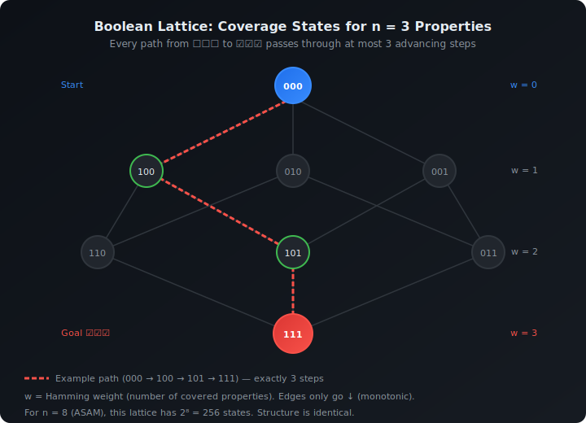
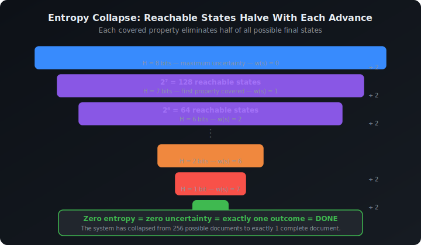
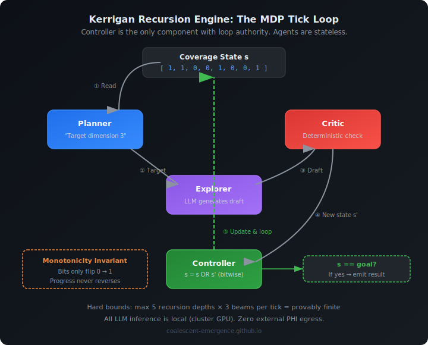

*How we used 70-year-old planning theory to guarantee that an LLM-powered documentation system will always finish its job — and why this matters far beyond healthcare.*

---

## The Problem Everyone Ignores

There's a dirty secret in the AI agent world: nobody can tell you when their system will stop.

Ask the builders of AutoGPT, BabyAGI, or any of the hundred LLM-agent-loop startups a simple question — *"How do you know your agent won't loop forever?"* — and the honest answer is: they don't. They set a `max_iterations` counter and hope for the best. The agent runs until it decides it's done, or until the budget runs out.

For a chatbot writing marketing copy, this is fine. For a system generating clinical documentation that a therapist will sign and a payer will audit, "hope for the best" is not a compliance strategy.

This is the problem we faced building **[Kerrigan](https://kerrigan.jhax.dev)**, our on-premises clinical transcription platform for behavioral health. Kerrigan listens to therapy sessions, transcribes them in real time, and then generates structured clinical notes — ASAM assessments, SOAP notes, BIRP notes — the administrative backbone of every behavioral health practice.

The generation step is where it gets interesting. These notes aren't free-form summaries. An ASAM assessment has 6 specific dimensions that must be addressed. A SOAP note has 4 sections. A BIRP note has 4. A clinical supervisor reviews these notes by checking whether each required section is adequately present. If dimension 3 is missing, the note gets kicked back.

We asked ourselves: can we *prove* — not hope, not empirically observe, but mathematically prove — that our system will always produce a complete note?

The answer is yes. And the proof turns out to be surprisingly elegant.

---

## The Insight: Clinical Notes Are Checklists, Not Essays

Most AI generation tasks are open-ended. "Write a good story" has no formal completion criterion. "Be helpful" is not a boolean. This is why most LLM agent systems can't guarantee convergence — there's no mathematical definition of "done."

But clinical documentation is different. A clinical supervisor doesn't read an ASAM note and assign it a subjective quality score on a scale of 1-10. They check a list:

- ☐ Acute Intoxication / Withdrawal Potential — addressed?
- ☐ Biomedical Conditions — addressed?
- ☐ Emotional / Behavioral / Cognitive Conditions — addressed?
- ☐ Readiness to Change — addressed?
- ☐ Relapse / Continued Use Potential — addressed?
- ☐ Recovery Environment — addressed?

Six boxes. For the coverage objective, each one can be treated as a boolean predicate: adequately addressed, or not. And critically: in this formulation, addressing dimension 4 does not un-address dimension 2. Progress is *cumulative*.

This structure — finite, independently checkable, cumulative — is not just convenient for clinical workflows. It is a precise mathematical object. And it has been studied for seventy years under a different name.

---

## A 256-Room House With Only One Way Out

Here's the key idea, translated from math into architecture.

Imagine a house with 256 rooms, arranged so that you always move forward, never backward. The house has exactly one exit. Every time you step into a new room, at least one door behind you locks permanently. You might wander around the same room for a while — the hallways are unpredictable — but every time you do move, you move closer to the exit.

The question is: **will you always eventually reach the exit?**

The answer — proven by mathematicians in the 1950s and 1960s — is an unconditional yes, as long as there's always *some* non-zero chance of moving forward from wherever you are.

Now replace "rooms" with "coverage states" and "moving forward" with "covering a new clinical documentation requirement." A coverage state is just a list of checkboxes: which properties have been satisfied so far? For an ASAM assessment with 6 dimensions, there are 2⁶ = 64 possible states (each dimension is either covered or not). For an 8-property decomposition, it's 2⁸ = 256 states.

The "exit" is the state where every checkbox is ticked.

The "unpredictable hallways" are the LLM — a stochastic engine that might or might not produce useful content on any given try.

And the "doors locking behind you" is the system's core design principle: **once a property is covered, it stays covered.** We accumulate content; we never delete what already works.

In Kerrigan, this looks like:

1. The **Planner** looks at which checkboxes are still empty and proposes which one to target next.
2. The **Explorer** generates a draft fragment addressing that target.
3. The **Critic** checks the draft against each property using an observation function. In the clean mathematical model, this checker is deterministic: it tells us which room we're now in.
4. The system takes the bitwise OR of the old state and the new observations. Bits only flip from 0 to 1, never back.

Every iteration either makes progress (flips at least one new bit) or stalls (the LLM produced something that didn't cover anything new). But it never goes backward.

---

## Why This Guarantees Convergence (The Lyapunov Argument)

Here is where the mathematics comes in. The specific proof technique is called a **Lyapunov function** — a tool from stability theory, originally developed for physical systems but applicable to any process where you can define a measure of "remaining work."

Define a simple function: **the number of uncovered properties.** At the start, if there are 8 properties, this function equals 8. When the system has covered 3 of them, it equals 5. When all are covered, it equals 0.

Call this function φ (phi). We can prove three things about φ:

**First: φ can never go negative.** You can't have fewer than zero uncovered properties. This is trivially true.

**Second: φ never increases.** Because coverage is monotonic (bits only flip 0→1, never 1→0), the number of uncovered properties can only stay the same or decrease. You never lose progress.

**Third: φ decreases in expectation by at least some fixed amount at every step where it's positive.** This is the critical step. If the LLM has even a 20% chance of covering a new property on any given attempt, then the *expected* decrease in φ per step is at least 0.2.

Now here's the punchline. This is the standard drift argument:

> **A non-negative quantity that decreases in expectation by a fixed positive amount at every step where it's positive must reach zero in finite expected time.**

φ starts at n (the number of properties). It decreases by at least p\_min (the minimum probability of progress) in expectation per step. Therefore:

**Expected time to completion ≤ n / p\_min**

For an 8-property ASAM note with a 30% advance probability per step:

**Expected completion ≤ 8 / 0.3 ≈ 27 steps**

This isn't a performance estimate. It's a mathematical upper bound.

![Lyapunov Descent: The count of uncovered properties (φ) over time. It stalls sometimes but never increases, and each advance drops it by at least 1. The orange dashed line shows the expected bound E[T] ≤ n/p_min.](images/lyapunov-descent.svg)

---

## Draining a Bathtub: The Energy Interpretation

There's an even more intuitive way to see why this works, borrowed from information theory.

At the start of the process, the system has maximum uncertainty about the *coverage state*. With 8 uncovered properties, there are 2⁸ = 256 reachable coverage states compatible with the current partial state.

Each time the system covers a new property, it eliminates half of the remaining possibilities. The number of reachable states goes from 256 → 128 → 64 → 32 → ... → 2 → 1.

When only one coverage state is reachable, **there is no more uncertainty about coverage**. The coverage objective has collapsed from 256 reachable states to exactly 1: the all-covered state.

Think of it as draining a bathtub. The water level (uncertainty) starts high. Each successful generation step opens the drain a little wider. The water only goes down, never up. And as long as the drain is open — as long as there's *some* chance of progress — the tub eventually empties.

The mathematical formulation is Shannon entropy: the number of bits needed to describe which reachable coverage state the system can still occupy. At the start, that's 8 bits (for 8 properties). Each successful advance removes at least 1 bit. So after at most 8 successful advances, zero bits remain. Zero bits = zero uncertainty about coverage = done.

This is what we mean when we say the system achieves **guaranteed convergence through entropy collapse**.

---

## What This Requires (And Where It Breaks)

This isn't magic, and it doesn't work everywhere. The convergence guarantee requires exactly four conditions:

### 1. Finite Property Decomposition
The completion criterion must break down into a finite number of boolean checks. ASAM has 6 core dimensions, though a concrete implementation may expand that into 6-8 tracked properties or sub-properties. SOAP has 4. This is what makes the state space small enough to reason about.

**Where it breaks:** "Write a good story." There's no finite decomposition of "good." The state space is effectively infinite, and no convergence bound applies.

### 2. Monotonic Accumulation
Progress must be one-directional. Covering property A must not un-cover property B. In Kerrigan, this is enforced by design: we accumulate document content and take the bitwise OR.

**Where it breaks:** Code generation. Fixing bug A can introduce bug B. The state oscillates between (1,0) and (0,1) indefinitely. This is precisely why AI coding agents (Devin, SWE-Agent, etc.) can't benefit from this theorem — their domain is fundamentally non-monotonic.

### 3. Positive Advance Probability
From any incomplete state, the LLM must have *some* non-zero probability of making progress. It doesn't need to be high — even 10% works (it just takes longer).

**Where it breaks:** If a required property is effectively outside the model's capability, the probability of useful progress can collapse to zero. Then convergence is not guaranteed. This is detectable in practice as repeated stalling, and the remedy is to change the model, the prompt, or the decomposition.

### 4. Deterministic Observation
The system that checks whether a property is covered must give consistent answers. If the checker says "yes" when the truth is "no," the system thinks it's made progress when it hasn't.

**Where it breaks:** If you use an LLM to judge whether an LLM's output is adequate, you've replaced deterministic observation with stochastic observation. The system becomes a POMDP (Partially Observable MDP) instead of a clean MDP, and the convergence guarantee weakens.

In Kerrigan, we handle this with a tiered observation system: deterministic keyword and structure matching (tiers 1-2) where that is sufficient, and calibrated LLM-based evaluation (tier 3) only where holistic judgment is unavoidable. Strictly speaking, the clean theorem applies to the deterministic part. Once you introduce stochastic adjudication, you are in approximation territory rather than theorem territory.

There is one more caveat that matters: the guarantee is only as strong as the predicates. If your checklist is shallow, you get guaranteed completion of a shallow checklist, not guaranteed clinical quality. The theorem proves coverage of the chosen properties, not omniscience.

---

## Beyond Clinical Notes: A Universal Pattern

Here's what surprised us most during this research: the convergence theorem has nothing to do with healthcare.

The proof operates on pure mathematical objects — bitvectors, probability bounds, Lyapunov functions. It doesn't mention therapy notes or ASAM dimensions anywhere. It says:

> **Any iterative system with finite, independently verifiable, non-retrogressing completion criteria will converge to a complete state in finite expected time, as long as each iteration has some positive probability of making progress and the observation process is reliable enough to preserve the monotone state update.**

Clinical documentation is our domain, but the theorem applies to any field that shares the same structural properties. Some examples:

| Domain | Properties | Why It Fits |
|--------|-----------|-------------|
| Legal contract drafting | Severability, governing law, liability cap, indemnification, ... | Clause presence is monotonic and verifiable |
| SOC-2 compliance documentation | 50-100 control requirements | Each control is independently auditable |
| HIPAA safeguard documentation | 18 required safeguards | Structured, enumerable, non-retrogressing |
| Architecture Decision Records | Context, decision, consequences, status, ... | Section presence is deterministic |
| Tax form preparation | Line items, schedules, attachments | Field completion is binary |

In every case, the completion criterion is a checklist, progress is cumulative, and verification is deterministic. The mathematical structure is identical.

We believe this identifies a previously unnamed class of problems — what we call **Monotonic Coverage MDPs** — that sits at the intersection of formal planning theory and natural language generation. The output is natural language (complex, high-dimensional), but the *completion criterion* is a boolean vector (simple, finite, enumerable). The convergence theorem exploits this duality: we don't need to reason about the full complexity of language; we only need to track the boolean projection.

---

## The Kerrigan Implementation

In Kerrigan, this theoretical framework runs inside what we call the **Recursion Engine** — a bounded multi-agent loop that orchestrates the note generation process.

The architecture has four specialized agents, each stateless:

- **Planner**: Examines the current coverage state, identifies uncovered properties, and proposes which dimension to explore next.
- **Explorer**: Given a target property, generates a document fragment using the LLM.
- **Critic**: Evaluates the generated fragment against all properties using the tiered observation system. Returns the new coverage state.
- **Summarizer**: Compresses the conversation history to keep within token budgets.

The Controller (the only component with loop authority) runs the MDP:

1. Get current coverage state s.
2. Ask the Planner which uncovered property to target next.
3. Send the Explorer to generate content for that property.
4. Have the Critic evaluate the result, producing new state s'.
5. Update: s = s OR s' (bitwise OR — monotonicity enforced here).
6. If s = goal state, stop. Otherwise, go to step 1.

On top of this, the system runs **multiple beams in parallel** — maintaining K candidate trajectories through the state space and pruning based on both quality scores and *coverage diversity* (preferring beams in different coverage states over beams that are all exploring the same dimension). This is an application of Diverse Beam Search (Vijayakumar et al., 2018) with the coverage bitvector serving as the natural diversity metric.

All inference runs on local hardware — a single GPU in our Kubernetes cluster — with zero data leaving the premises. PHI never touches an external API. The generation stack uses local quantized models accessed through a cluster-internal gateway.

The production system also imposes hard operational caps on search depth and beam width. Those are engineering guardrails. They are not the source of the convergence proof, which lives in the monotone coverage process itself.

---

## What This Means for the Field

The broader implication is that there's a large, practical, underexplored class of LLM generation tasks where you *can* make strong formal guarantees — not by constraining the LLM itself, but by constraining the *system* around it.

The LLM is the stochastic engine. It will hallucinate. It will go off-topic. It will occasionally produce garbage. That's fine.

The coverage state is the deterministic frame. It doesn't care what the LLM said — it cares what properties are now satisfied. The bitwise OR ensures no regression. The observation function provides ground truth.

Between the stochastic engine and the deterministic frame, the convergence theorem guarantees the outcome.

This is the same pattern used in control theory for decades: a noisy plant (the LLM) stabilized by a feedback controller (the coverage state tracker) with a Lyapunov function (remaining uncovered properties) that proves stability. The mathematics is from the 1950s. The application to LLM agent systems is new.

We think this has implications well beyond healthcare — anywhere structured documents need to be reliably generated from unstructured input. But clinical documentation is where the stakes are highest, the regulatory requirements are strictest, and the checklist structure is already built into the domain.

Kerrigan is the proof that the theory works in practice. The convergence theorem is the proof that the practice works in theory.

---

## Appendix: Formal Proofs, Citations, and Technical Detail

*This section presents the complete mathematical machinery. Readers comfortable with the intuitive description above can stop here; what follows is the formal apparatus for peer review and academic scrutiny.*

### A.1 Formal Definitions

**Definition 1 (Property-Decomposed Completion Criterion).** A completion criterion C is *property-decomposable* if there exist n boolean predicates {P₁, P₂, ..., Pₙ} such that C is satisfied if and only if every Pᵢ evaluates to true:

$$C(doc) = P_1(doc) \wedge P_2(doc) \wedge \cdots \wedge P_n(doc)$$

**Definition 2 (Coverage State).** Given a document and predicates {P₁, ..., Pₙ}, the coverage state is the bitvector:

$$s = (P_1(doc), P_2(doc), \ldots, P_n(doc)) \in \{0,1\}^n$$

The goal state is $s^* = (1,1,\ldots,1)$. The Hamming weight $w(s)$ counts the number of satisfied properties.

**Definition 3 (Monotonic Transition).** A transition from $s$ to $s'$ is monotonic if $s' \geq s$ componentwise: for all $i$, $s'_i \geq s_i$.

**Definition 4 (Monotonic Coverage MDP).** The class $\mathcal{M}_n$ consists of tuples $(\{0,1\}^n, A, P, R, h)$ where $P(s'|s,a) = 0$ whenever $s' \not\geq s$ (monotonicity baked into the transition kernel), $R(s,a,s') = w(s') - w(s)$, and $h$ is a deterministic observation function.

### A.2 The Convergence Theorem

**Theorem (Guaranteed Convergence).** Let $\{s_t\}$ be a sequence of coverage states in $\{0,1\}^n$ with $s_0 = \mathbf{0}$, subject to:

1. **Monotonicity:** $s_{t+1} \geq s_t$ componentwise.
2. **Positive advance probability:** $\Pr[w(s_{t+1}) > w(s_t) \mid s_t = s,\ w(s) < n] \geq p_{\min} > 0$.

Let $T = \inf\{t : s_t = s^*\}$. Then:

- **(a)** $\Pr[T < \infty] = 1$ (almost-sure convergence).
- **(b)** $\mathbb{E}[T] \leq n / p_{\min}$ (finite expected time).

### A.3 Proof via Lyapunov Function / Drift Argument

*Reference: Doob (1953), Stochastic Processes; Williams (1991), Probability with Martingales.*

Define the potential function: $\varphi(s_t) = n - w(s_t)$ (uncovered property count).

**Step 1 (Non-negativity):** $\varphi(s_t) = n - w(s_t) \geq 0$, since $w(s_t) \leq n$. ✓

**Step 2 (Non-increasing):** By monotonicity, $w(s_{t+1}) \geq w(s_t)$, so $\varphi(s_{t+1}) \leq \varphi(s_t)$. ✓

**Step 3 (Strictly negative drift when $\varphi > 0$):** For non-terminal states:

$$\mathbb{E}[\varphi(s_{t+1}) \mid s_t] = n - \mathbb{E}[w(s_{t+1}) \mid s_t]$$

Since $w(s_{t+1}) \geq w(s_t) + 1$ with probability $\geq p_{\min}$:

$$\mathbb{E}[w(s_{t+1}) \mid s_t] \geq w(s_t) + p_{\min}$$

Therefore:

$$\mathbb{E}[\varphi(s_{t+1}) \mid s_t] \leq \varphi(s_t) - p_{\min}$$

The drift is $\mathbb{E}[\varphi(s_{t+1}) - \varphi(s_t) \mid s_t] \leq -p_{\min} < 0$. ✓

**Step 4 (Finite expected hitting time):** Define the stopped time $\tau_m = T \wedge m$. Applying the drift inequality up to $\tau_m$ gives:

$$\mathbb{E}[\varphi(s_{\tau_m})] \leq \varphi(s_0) - p_{\min}\,\mathbb{E}[\tau_m]$$

Since $\varphi(s_{\tau_m}) \geq 0$ and $\varphi(s_0)=n$:

$$\mathbb{E}[\tau_m] \leq n / p_{\min}$$

Letting $m \to \infty$ yields $\mathbb{E}[T] \leq n / p_{\min}$. Since a random variable with finite expectation is finite almost surely, $\Pr[T < \infty] = 1$. \qquad \blacksquare

### A.4 Proof via Information-Theoretic Entropy

*Reference: Shannon (1948); Cover & Thomas (2006).*

The reachable set from state $s_t$ with $w(s_t) = k$ is:

$$\mathcal{R}(s_t) = \{s \in \{0,1\}^n : s \geq s_t\}, \quad |\mathcal{R}(s_t)| = 2^{n-k}$$

The reachability entropy $H_t = \log_2|\mathcal{R}(s_t)| = n - k = \varphi(s_t)$.

Each advance removes $\geq 1$ bit of entropy (halves the reachable set). Starting from $H_0 = n$ bits, with advances occurring at rate $\geq p_{\min}$:

$$\mathbb{E}[T_{\text{collapse}}] \leq n / p_{\min}$$

At $H = 0$: $|\mathcal{R}(s_t)| = 1$. Only one coverage state is reachable. The system has collapsed from $2^n$ reachable coverage states to exactly 1. $\blacksquare$

### A.5 Proof via Absorbing Markov Chain

*Reference: Kemeny & Snell (1960), Finite Markov Chains, Theorem 3.3.5.*

The state $s^* = (1,\ldots,1)$ is absorbing. All other states are transient with positive probability of reaching $s^*$ (via at most $n-k$ advancing steps, each occurring with probability $\geq p_{\min}^{n-k} > 0$). By the Fundamental Theorem of Absorbing Markov Chains, absorption occurs with probability 1 in finite expected time. $\blacksquare$

### A.6 Necessary Conditions

| # | Condition | If Violated |
|---|-----------|-------------|
| C1 | Finite property decomposition ($n < \infty$) | No convergence bound |
| C2 | Monotonic accumulation ($s' \geq s$) | Cycles possible; system can oscillate |
| C3 | Positive advance probability ($p_{\min} > 0$) | Goal may be unreachable |
| C4 | Reliable observation | False coverage claims can corrupt state; clean theorem no longer applies directly |

### A.7 Bibliography

**Foundational Probability:**
1. Doob, J. L. (1953). *Stochastic Processes*. Wiley. — Supermartingale convergence theorem (VII.4.1).
2. Williams, D. (1991). *Probability with Martingales*. Cambridge. — Modern martingale treatment (Ch. 11-12).
3. Kemeny, J. G. & Snell, J. L. (1960). *Finite Markov Chains*. Van Nostrand. — Absorbing chain absorption theorem (3.3.5).
4. Norris, J. R. (1997). *Markov Chains*. Cambridge. — Hitting times and absorption (Ch. 1.3, 1.5).
5. Foster, F. G. (1953). On the stochastic matrices associated with certain queuing processes. *Ann. Math. Stat., 24*(3), 355-360. — Foster's criterion for positive recurrence via Lyapunov drift.

**Information Theory:**
6. Shannon, C. E. (1948). A mathematical theory of communication. *Bell Syst. Tech. J., 27*(3), 379-423.
7. Cover, T. M. & Thomas, J. A. (2006). *Elements of Information Theory* (2nd ed.). Wiley. — Entropy, data processing inequality (Ch. 2, 5).

**MDPs and Dynamic Programming:**
8. Bellman, R. (1957). *Dynamic Programming*. Princeton. — Bellman equation, principle of optimality.
9. Puterman, M. L. (1994). *Markov Decision Processes*. Wiley. — Finite MDP value iteration (Ch. 5-6).
10. Bertsekas, D. P. (2017). *Dynamic Programming and Optimal Control, Vol. II* (4th ed.). Athena Scientific. — POMDP → MDP reduction under deterministic observation (Ch. 4).

**Partial Observability:**
11. Kaelbling, L. P., Littman, M. L. & Cassandra, A. R. (1998). Planning and acting in partially observable stochastic domains. *Artif. Intell., 101*(1-2), 99-134.

**Lattice Theory:**
12. Birkhoff, G. (1967). *Lattice Theory* (3rd ed.). AMS. — Boolean lattice structure, Hasse diagrams.
13. Davey, B. A. & Priestley, H. A. (2002). *Introduction to Lattices and Order* (2nd ed.). Cambridge. — DAG chain length bounds for {0,1}ⁿ.

**NLP Beam Search:**
14. Freitag, M. & Al-Onaizan, Y. (2017). Beam search strategies for neural machine translation. *arXiv:1702.01806*.
15. Vijayakumar, A. K. et al. (2018). Diverse beam search. *arXiv:1610.02424*. — Hamming diversity penalty.
16. Kool, W., Van Hoof, H. & Welling, M. (2019). Stochastic beams and where to find them. *ICML*. — Gumbel-Top-k.

**LLM Agent Architectures:**
17. Yao, S. et al. (2023). ReAct: Synergizing reasoning and acting in language models. *ICLR*.
18. Shinn, N. et al. (2023). Reflexion: Language agents with verbal reinforcement learning. *NeurIPS*.
19. Zhou, A. et al. (2023). Language Agent Tree Search. *arXiv:2310.04406*.
20. Yao, S. et al. (2023). Tree of Thoughts. *NeurIPS*.

**Formal Verification:**
21. Alpern, B. & Schneider, F. B. (1985). Defining liveness. *Inf. Process. Lett., 21*(4), 181-185.
22. Lamport, L. (1977). Proving the correctness of multiprocess programs. *IEEE Trans. Softw. Eng., SE-3*(2), 125-143.
23. Claessen, K. & Hughes, J. (2000). QuickCheck: A lightweight tool for random testing of Haskell programs. *ICFP*.
