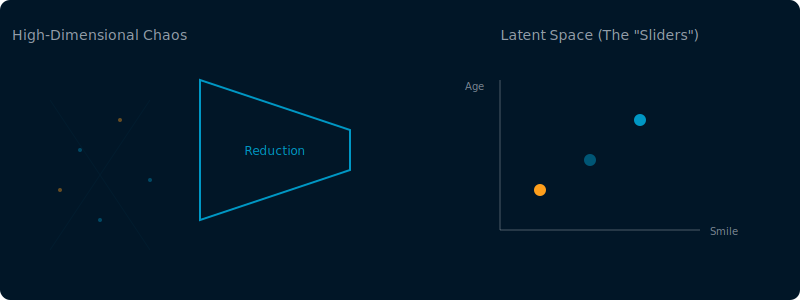
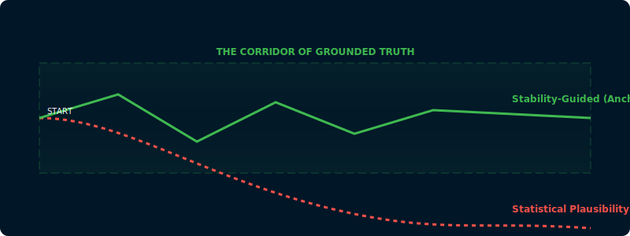
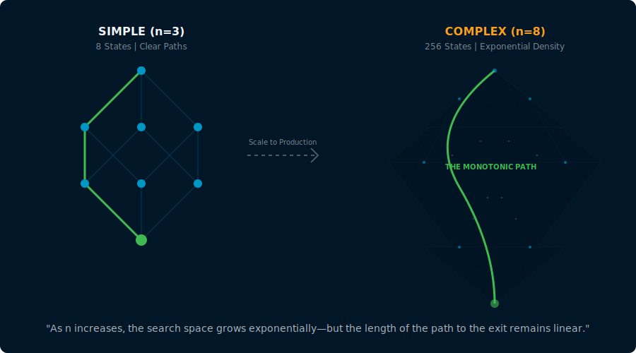
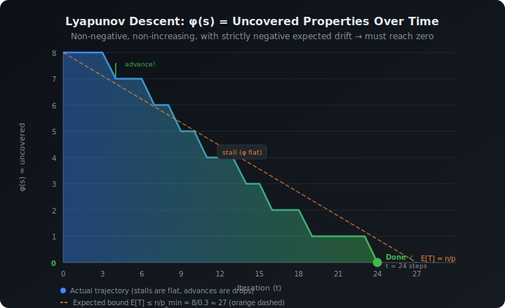

## 1. Physical Foundations: Dimensions as Conversion Operators
Let's start with the heavy hitters: constants like $c$, $G$, $\hbar$, and $k_B$. We usually think of these as just "numbers in a formula," but they're actually **conversion operators**—the invariant bridges linking length, time, mass, charge, and temperature. 

For example:
- **$c$** isn't just the speed of light; it's the operator relating time to length.
- **$G$** ties mass-energy scales to the actual curvature of spacetime.

Their numerical values are arbitrary (depending on your unit system), but their *deeper role* is to define the "exchange rate" between different fundamental dimensions. If you want to reason consistently across different scales of reality, you need these invariants.

**The Hacker Takeaway:** In AI, we face a similar problem. How do you relate a "Logic" score to an "Evidence Grounding" score? You need "Stability Weights" that act as the physical constants of your system, defining the invariant bridges between different dimensions of truth.

---

## 2. The Manifold Hypothesis: AI's Hidden Geometry
Why does dimensional reduction actually work? It’s not just a compression hack; it’s the **Manifold Hypothesis**.

The idea is that high-dimensional data (like the pixels of a face or the tokens in a medical transcript) doesn't actually fill the entire high-dimensional space. Instead, it sits on a much lower-dimensional **manifold**—a thin, curved "sheet" of reality embedded in the chaos.

When we train an LLM, we're essentially trying to learn the coordinates of this manifold. This is your **latent space**. Instead of tracking 100,000 token probabilities, the system learns the 3,000 meaningful "directions" that define a coherent thought. We lose the microscopic noise, but we keep the geometry.

---

## 3. The Problem: Statistical Plausibility vs. Dynamical Stability
Standard LLMs generate text by picking the next token that is **most statistically plausible**. In control theory terms, this is an "unstable plant." The model follows the path of least resistance (plausibility) without a feedback loop to keep it anchored to the manifold of truth.

This is where hallucinations come from: the model's trajectory "drifts" off the manifold into the high-dimensional void where things sound "natural" but are factually impossible.

### Stability-Guided Generation
To fix this, we stop asking "what sounds likely?" and start treating generation as a **Dynamical System**. We want a system where the "true" state is a **Global Attractor**.

We measure "drift" using concrete signals:
- **NLI Cross-Encoders:** To detect contradictory entailment between the draft and the source.
- **Embeddings Distance:** Measuring how far the current hidden state has wandered from the trusted evidence cluster in latent space.

---

## 4. Lyapunov Functions: Proving It Finishes
But how do you *guarantee* the system stays on track? You define a **Lyapunov Function** $V(s)$.

In mathematics, for a system to be stable, we need a function $V(s)$ that is:
1. **Positive-Definite:** $V(s) > 0$ whenever we aren't at the goal.
2. **Negative-Definite Derivative:** $\dot{V}(s) < 0$ along every trajectory.

Basically, $V(s)$ measures the "Energy" or "Remaining Work." If we can prove that every generation step *must* reduce the total energy, we've proven the system **must** reach the goal.

### The Composite Stability Potential
We can define a stability potential $V$ as a function of our coverage state:
$$V(s) = \sum_{i=1}^{n} w_i (1 - P_i(doc))$$
*(Where $P_i$ is a boolean predicate for property $i$, and $w_i$ are our "Physical Constants")*

Because our system is designed for **Monotonic Accumulation** (once a fact is verified, we OR it into the state and never delete it), the "derivative" of our potential function is always negative. Every time we flip a bit from 0 to 1, $V(s)$ drops.

---

## 5. Draining the Tub: The Entropy Interpretation
Think of the system's uncertainty as a bathtub full of water. At the start, the "water level" (Shannon Entropy) is high. Each successful generation step opens a drain.

Because progress is monotonic, the water only goes down. As long as our LLM has even a non-zero probability of producing a useful token, the tub **must** eventually empty. This isn't a "vibe"; it's a mathematical upper bound on execution time.

### Conclusion: Killing the Vibes
The future of reliable AI isn't just "bigger models." It's **wrapping stochastic engines in deterministic frames.** By using the Manifold Hypothesis to understand where we are, and Lyapunov Functions to prove where we're going, we can move beyond "vibes-based" AI and start building systems that are provably, mathematically stable.

